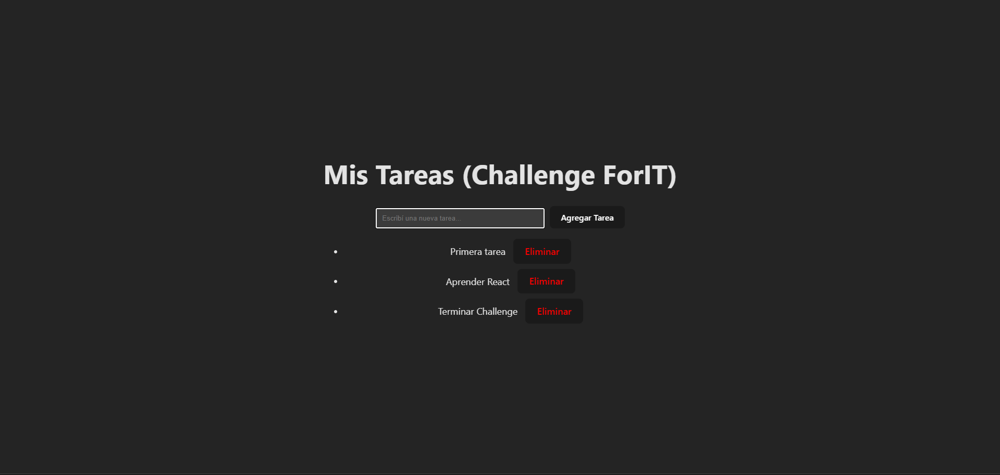

# Challenge Ingreso Academia ForIT 2025

Proyecto desarrollado para el ingreso a la Academia ForIT. Consiste en una aplicación de lista de tareas (To-Do List) con un backend en Node.js y un frontend en React.

## Tecnologías Utilizadas
- **Backend:** Node.js y Express 
- **Frontend:** React y Vite
- **Control de Versiones:** Git 

## Requisitos Cumplidos
- Servidor con Express y endpoints GET, POST y DELETE.
- Almacenamiento temporal en un array en memoria.
- ]Aplicación de React con componentes TaskList y TaskForm.
- Manejo de estado con Hooks en React.

## Instrucciones para ejecutar localmente

### 1. Clonar el repositorio
```bash
git clone <https://github.com/FrancoTittarelli/Challenge-ForIT.git>
cd challenge-forit
```


